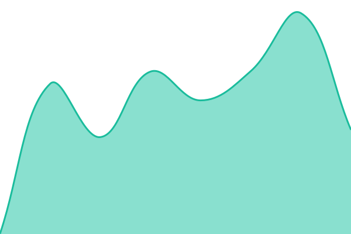
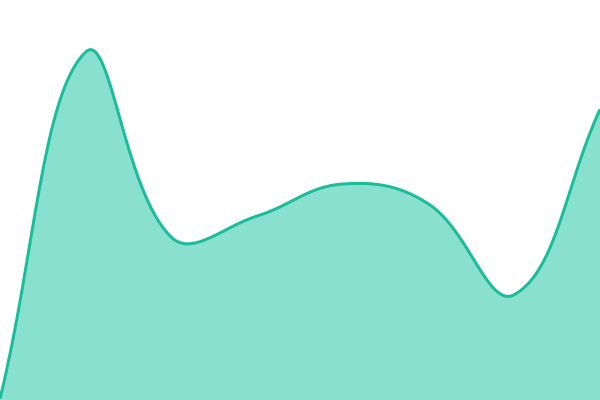

# [📈 Live Status](https://status.tritone.dev): <!--live status--> **🟧 Partial outage**

This repository contains the open-source uptime monitor and status page for [Kyle](https://tritone.dev), powered by [Upptime](https://github.com/upptime/upptime).

With [Upptime](https://upptime.js.org), you can get your own unlimited and free uptime monitor and status page, powered entirely by a GitHub repository. We use [Issues](https://github.com/Kyle8973/Tritone-Status/issues) as incident reports, [Actions](https://github.com/Kyle8973/Tritone-Status/actions) as uptime monitors, and [Pages](https://status.tritone.dev) for the status page.

<!--start: status pages-->
<!-- This summary is generated by Upptime (https://github.com/upptime/upptime) -->
<!-- Do not edit this manually, your changes will be overwritten -->
<!-- prettier-ignore -->
| URL | Status | History | Response Time | Uptime |
| --- | ------ | ------- | ------------- | ------ |
|  [Tritone Website](https://tritone.dev) | 🟩 Up | [tritone-website.yml](https://github.com/Kyle8973/Tritone-Status/commits/HEAD/history/tritone-website.yml) | 

 133ms
     
 | 

<a href="https://status.tritone.dev/history/tritone-website">100.00%</a>
    

|  [GitHub Repository](https://github.com/Kyle8973/Tritone) | 🟩 Up | [git-hub-repository.yml](https://github.com/Kyle8973/Tritone-Status/commits/HEAD/history/git-hub-repository.yml) | 

 682ms
     
 | 

<a href="https://status.tritone.dev/history/git-hub-repository">100.00%</a>
    

|  [GitHub Status API](https://www.githubstatus.com/api/v2/status.json) | 🟥 Down | [git-hub-status-api.yml](https://github.com/Kyle8973/Tritone-Status/commits/HEAD/history/git-hub-status-api.yml) | 

 107ms
     
 | 

<a href="https://status.tritone.dev/history/git-hub-status-api">87.72%</a>
    

|  [Last.FM API](https://ws.audioscrobbler.com/2.0/?method=chart.gettoptracks&format=json&api_key=test) | 🟩 Up | [last-fm-api.yml](https://github.com/Kyle8973/Tritone-Status/commits/HEAD/history/last-fm-api.yml) | 

 137ms
     
 | 

<a href="https://status.tritone.dev/history/last-fm-api">100.00%</a>
    

|  [Discord API](https://discord.com/api/v10/gateway) | 🟩 Up | [discord-api.yml](https://github.com/Kyle8973/Tritone-Status/commits/HEAD/history/discord-api.yml) | 

 56ms
     
 | 

<a href="https://status.tritone.dev/history/discord-api">100.00%</a>
    

|  [Google Fonts API](https://fonts.googleapis.com/css2?family=Roboto) | 🟩 Up | [google-fonts-api.yml](https://github.com/Kyle8973/Tritone-Status/commits/HEAD/history/google-fonts-api.yml) | 

 56ms
     
 | 

<a href="https://status.tritone.dev/history/google-fonts-api">100.00%</a>
    

|  [LRCLIB Lyrics API](https://lrclib.net/api/get?artist_name=test&track_name=test&album_name=test) | 🟩 Up | [lrclib-lyrics-api.yml](https://github.com/Kyle8973/Tritone-Status/commits/HEAD/history/lrclib-lyrics-api.yml) | 

 4240ms
     
 | 

<a href="https://status.tritone.dev/history/lrclib-lyrics-api">100.00%</a>
    

|  [TheAudioDB API](https://www.theaudiodb.com/api/v1/json/2/search.php?s=coldplay) | 🟩 Up | [the-audio-db-api.yml](https://github.com/Kyle8973/Tritone-Status/commits/HEAD/history/the-audio-db-api.yml) | 

 209ms
     
 | 

<a href="https://status.tritone.dev/history/the-audio-db-api">99.30%</a>
    

|  [Wikipedia API](https://en.wikipedia.org/api/rest_v1/page/summary/Coldplay) | 🟩 Up | [wikipedia-api.yml](https://github.com/Kyle8973/Tritone-Status/commits/HEAD/history/wikipedia-api.yml) | 

 96ms
     
 | 

<a href="https://status.tritone.dev/history/wikipedia-api">100.00%</a>
    

|  [Cloudflare](https://www.cloudflarestatus.com/api/v2/status.json) | 🟥 Down | [cloudflare.yml](https://github.com/Kyle8973/Tritone-Status/commits/HEAD/history/cloudflare.yml) | 

 124ms
     
 | 

<a href="https://status.tritone.dev/history/cloudflare">87.73%</a>
    

<!--end: status pages-->

[**Visit our status website →**](https://status.tritone.dev)

## 📄 License

- Powered by: [Upptime](https://github.com/upptime/upptime)
- Code: [MIT](./LICENSE) © [Anand Chowdhary](https://anandchowdhary.com), supported by [Pabio](https://pabio.com)
- Data in the `./history` directory: [Open Database License](https://opendatacommons.org/licenses/odbl/1-0/)
